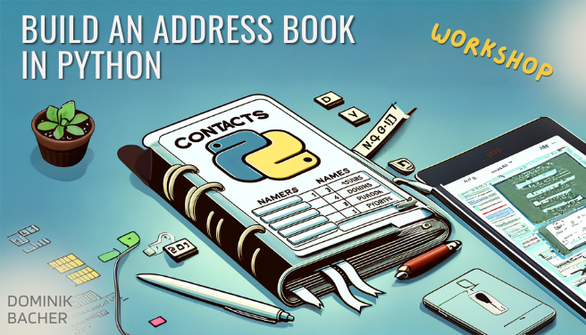

# Hi there! :raised_hands:

Welcome to the GitHub profile of **Dominik Bacher**.

## About Me:
- :computer: Computer Engineer
- :bar_chart: Data Scientist
- :man_technologist: Programming Aficionado

🔗 [Connect with me on LinkedIn](https://www.linkedin.com/in/your-linkedin-username/)

## My Top 6 Projects:

<table cellspacing="0" cellpadding="0" border="0">
  <tr>
    <td></td>
    <td></td>
  </tr>
  <tr>
    <td></td>
    <td></td>
  </tr>
  <tr>
    <td></td>
    <td></td>
  </tr>
</table>

_Images created using DALL·E 3._

Thanks for stopping by!

_Don't forget to star a repo you find interesting._
